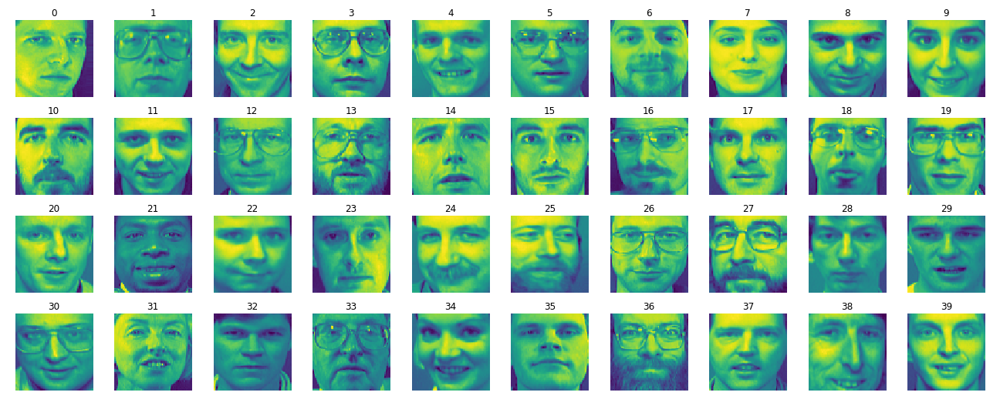

# Logistic Regression

These notebooks cover various aspects of binary and multinary classification using Logistic Regression.

1. [Logistic Regression](LogisticRegression.ipynb)

    Analysis of the Iris Dataset using sklearn's <tt>LogisticRegression</tt> classifier using one and two variables. Visualizing decision boundaries. 
Closely follows [Geron's analysis](https://www.oreilly.com/library/view/hands-on-machine-learning/9781492032632/). 

2. [Binary Fashion MNIST](BinaryFMNIST.ipynb)

    The Fashion MNIST dataset consists of 28x28 grayscale images of clothing items drawn from 10 classes such as boots, shirts, pullovers etc. We use
sklearn's <tt>SGDClassifier</tt> along with cross-validation to solve a binary problem of distinguishing between shirts and all other classes. We also introduce metrics for classifiers
such as the confusion matrix, precision, and recall which are all very useful when class populations are skewed. We show how the decision boundary of a 
classifier can be tuned to increase precision or recall, usually at each other's expense. We close with defining and computing the _receiver operator characterestic (ROC)_ 
curve and the area under it, both of which are also important diagnostic metrics for a classifier.

3. [Fashion MNIST](FashionMNIST.ipynb)

    We next consider the classification problem of the complete Fashion MNIST dataset consisting of 10 classes which we also solve using the SGDClassifier and cross-validation. 
The classifier reaches about 81% accuracy on the test set (approximately). This should be thought of as a baseline to compare the performance of a neural network with. 

4. [Olivetti Faces](OlivettiFaces.ipynb)

    The final problem we consider is the Olivetti Faces dataset consisting of 400 images from 40 classes (i.e. 10 images per person). Each image is 64x64 i.e. 4096-dimensional. As an
exercise we also carry out dimensionality reduction using [principal component analysis](https://en.wikipedia.org/wiki/Principal_component_analysis) to a set of 100 dimensional vectors 
and retrain the classifier to find roughly comparable performance. (93% vs 98%, both approx.).

The following images are sampled from the Olivetti Face dataset for reference.

